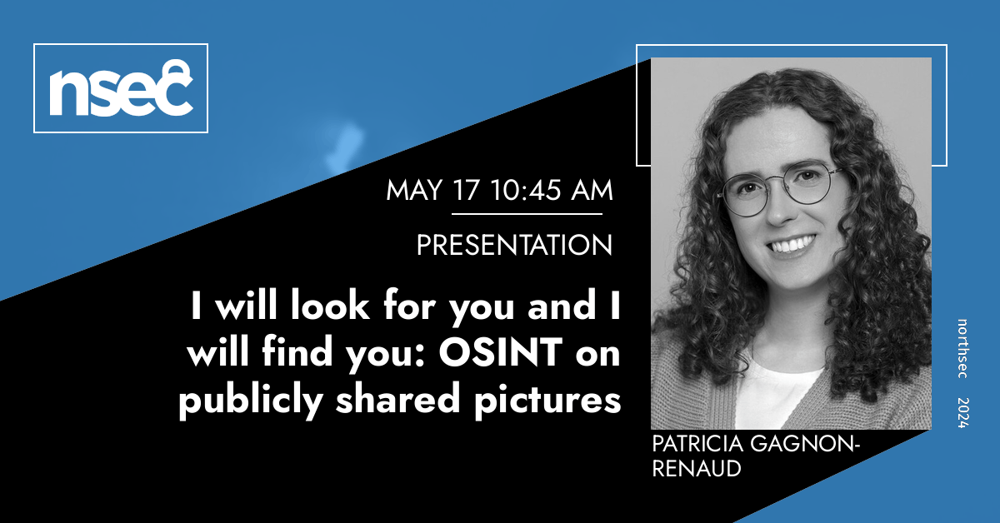

# I will look for you and I will find you: OSINT on publicly shared pictures

> Liam Neeson is coming for you. But how will he find you? Come to this talk to learn how the picture of a firetruck you took in front of your house and shared on Instagram two years ago will be the source of your demise.
>
> In this talk, I will share how I developed this compulsive habit, in which I need to find where a picture was taken. We will cover how to perform open-source intelligence (OSINT) on publicly shared pictures and videos, which tools and techniques to use, accompanied with real step-by-step examples.
>
> I believe that understanding how OSINT works is key to better protect ourselves online. I'm aiming to give you the tools and knowledge to be better cybersecurity professionals, and learn to be more careful and diligent online, all in a (hopefully) fun and engaging way.
>
> Not convinced yet? This talk will also cover the following topics: metadata (d'oh!), physical keys (who doesn't like keys?), data in public registries, and conclude with Do's and Don'ts for everyone.

Presented at NorthSec 2024: https://nsec.io/session/2024-i-will-look-for-you-and-i-will-find-you-osint-on-publicly-shared-pictures.html

Full talk available on YouTube: https://www.youtube.com/watch?v=XKPxlctcidQ

## Tools

- Google Search and Lens: https://www.google.com/
- Google Maps (2D and 3D): https://www.google.com/maps
- Bing Maps: https://www.bing.com/maps
- Geospatial Portal "VGO" of MERN Québec: https://vgo.portailcartographique.gouv.qc.ca/
- OpenStreetMap Overpass API: https://wiki.openstreetmap.org/wiki/Overpass_API
- Wayback Machine: https://wayback-api.archive.org/
- Key Code From Photograph: https://cq.cx/key.html
- ExifTool: https://exiftool.org/
- domain whois: https://lookup.icann.org/en/lookup
- Sun Locator: https://play.google.com/store/apps/details?id=com.genewarrior.sunlocator.lite
- Canada411: https://www.canada411.ca/
- Canada Post AddressComplete: https://www.canadapost-postescanada.ca/ac/
- Évaluation foncière Montréal: https://montreal.ca/evaluation-fonciere
- Registre foncier du Québec: https://www.registrefoncier.gouv.qc.ca
- Registre des entreprises du Québec: https://www.quebec.ca/entreprises-et-travailleurs-autonomes/obtenir-renseignements-entreprise

## Sources

- https://en.wikipedia.org/wiki/Open-source_intelligence
- https://en.wikipedia.org/wiki/Personal_data
- https://en.wikipedia.org/wiki/Metadata
- https://en.wikipedia.org/wiki/Geotagging
- https://scottmeyers.blogspot.com/2022/01/image-metadata-metadata-removal-problem.html
- https://exiftool.org/forum/index.php?topic=9862.msg51226#msg51226
- https://en.wikipedia.org/wiki/Doxing
- https://en.wikipedia.org/wiki/Stalking
- https://en.wikipedia.org/wiki/Identity_theft
- https://www.youtube.com/watch?v=DoQT5i9Iz84 (“I owe you an explanation”, Linus Tech Tips)
- https://www.youtube.com/watch?v=-duJtlw394U (“Our LAN Parties will be INSANE”, Linus Tech Tips)
- https://ici.radio-canada.ca/tele/le-telejournal-18h/site/segments/reportage/465457/pont-ile-tourte-congestion-voiture-travaux
- https://ici.radio-canada.ca/tele/le-telejournal-18h/site/segments/reportage/1796808/internet-photo-cambriolage-cle-clef-dememangement
- https://www.youtube.com/watch?v=ZhMA-0s31SI (“Attention aux doubleurs de clés”, Radio-Canada Info)
- https://burglarsguide.com/ (“A Burglar’s Guide to the City”, 2016)
- https://www.canadapost-postescanada.ca/cpc/en/personal/mymail.page

## Thanks

- My friends and family
- Josée Nadeau (Sous les Oliviers)
- Mathieu Prost (Radio-Canada)
- Andréanne Bergeron (GoSecure) and Olivier Bilodeau (Flare)
- Laurent Desaulniers (Mandiant)
- Maxime Nadeau (GoSecure)
