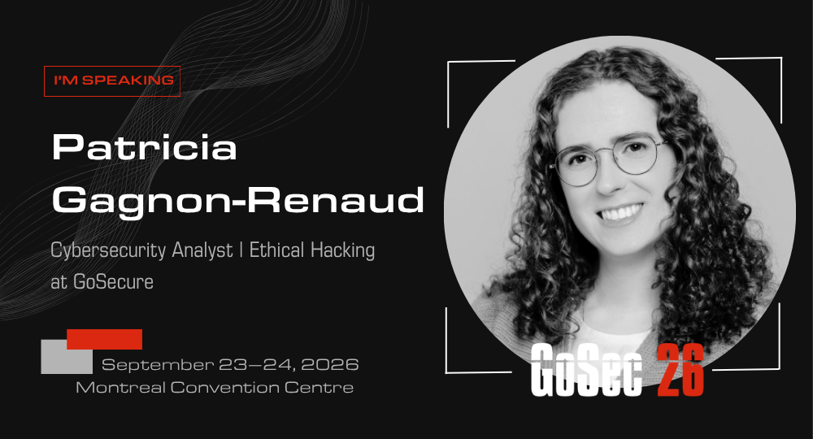

# OSINT201



## [ENGLISH] 2 OSINT 2 Find You: Real-life OSINT Applications in Pentest

> Two years ago, I showcased basic OSINT techniques which led me to make the local news, by unlocking the front door of an overconfident store owner. For my second talk, I want to show more common applications of OSINT in pentesting, accompanied by new examples and techniques.
>
> These will include the use of the OpenStreetMap Overpass API to find full addresses from partial information, as well as the use of the many people-search-tools and reverse-image-search-engines to find and collect PII of targeted individuals.
>
> I believe that understanding how OSINT works is key to better protect ourselves online. I’m aiming to give you the tools and knowledge to be better cybersecurity professionals, and learn to be more careful and diligent online, all in a fun and engaging way.

## [FRANÇAIS] OSINT rechargée: Applications concrètes de l'OSINT en pentest

> Il y a deux ans, j’ai présenté les techniques de base de l’OSINT qui m’ont valu de paraître au téléjournal, en déverrouillant la porte d’entrée d’une propriétaire de commerce trop sûr d’elle-même. Pour ma deuxième conférence, je souhaite montrer des applications plus courantes de l’OSINT en pentest, accompagné de nouveaux exemples et techniques.
>
> Il s’agira notamment d’utiliser l’Overpass API d’OpenStreetMap pour trouver des adresses complètes à partir d’informations partielles, ainsi que d’utiliser les nombreux outils de recherche de personnes et moteurs de recherche d’images inversées pour trouver et rassembler les PII de personnes ciblées.
>
> Je crois que comprendre le fonctionnement de l’OSINT est essentiel pour mieux nous protéger en ligne. Mon objectif est de vous donner les outils et les connaissances nécessaires pour devenir de meilleurs professionnels de la cybersécurité et apprendre à être plus prudents et diligents en ligne, le tout d’une manière amusante et engageante.

## Instances

- Presenting at GoSec 2026: https://app.swapcard.com/event/gosec-2026/planning/UGxhbm5pbmdfNDUyNzQ4Mw== (https://gosec.net/)

- Presenting at Hackfest 2026: Confirmed ✅ | Schedule ⏳ (https://hackfest.ca/)

## Tools

- WiGLE: https://wigle.net/
- Google Search and Lens: https://www.google.com/
- ChatGPT: https://chatgpt.com/
- Google Maps (2D and 3D): https://www.google.com/maps
- CellMapper: https://www.cellmapper.net/
- Canada Post AddressComplete: https://www.canadapost-postescanada.ca/ac/
- OpenStreetMap: https://www.openstreetmap.org/
- OpenStreetMap Overpass API: https://wiki.openstreetmap.org/wiki/Overpass_API
- OpenStreetMap Overpass Turbo: https://overpass-turbo.eu/
- LinkedIn: https://www.linkedin.com/
- Facebook: https://www.facebook.com/
- TruePeopleSearch: https://www.truepeoplesearch.com/
- Anywho: https://www.anywho.com/
- FaceSeek: https://www.faceseek.online/
- PimEyes: https://pimeyes.com/
- Système électronique d'appel d'offres du gouvernement du Québec: https://seao.gouv.qc.ca/
- Registre des entreprises du Québec: https://www.quebec.ca/entreprises-et-travailleurs-autonomes/obtenir-renseignements-entreprise

## Medias

- “rainbolt finds epstein's password”, rainbolt clips: https://www.youtube.com/shorts/mFa7DacehiM
- “Lightning Round 17”, josemonkey: https://www.youtube.com/shorts/71VnTqPANkg
- “I used OSINT to find the real One Piece ocean drop location”, colsto: https://www.youtube.com/watch?v=eY-W9gmwxhg
- “I owe you an explanation”, Linus Tech Tips: https://www.youtube.com/watch?v=DoQT5i9Iz84
- “1. Bienvenue au Repaire des Vilains”, La maison des vilains: https://www.crave.ca/fr/series/la-maison-des-vilains-61566
- “PETITE DEVINETTE DE L’APRÈS-MIDI!”, Liquidation Marie inc.: https://www.facebook.com/reel/1046691928290947

## Sources

- https://en.wikipedia.org/wiki/Open-source_intelligence
- https://en.wikipedia.org/wiki/Personal_data
- https://en.wikipedia.org/wiki/Metadata
- https://en.wikipedia.org/wiki/Geotagging
- https://en.wikipedia.org/wiki/Artificial_intelligence
- https://en.wikipedia.org/wiki/Generative_AI
- https://en.wikipedia.org/wiki/Large_language_model
- https://en.wikipedia.org/wiki/Education_in_the_United_States#Educational_stages
- https://en.wikipedia.org/wiki/Higher_education_in_Quebec#General_overview_of_university_education

## Thanks

- My work colleagues
- Laurent Desaulniers (Mandiant)
- Maxime Nadeau (GoSecure)

## Overpass QL examples

### Tile-Server for satellite background

```
https://services.arcgisonline.com/ArcGIS/rest/services/World_Imagery/MapServer/tile/{z}/{y}/{x}
```

### Find addresses with civic number

```js
[out:json][timeout:60];

// Define the search area by name
{{geocodeArea:"Surrey, British Columbia"}}->.searchArea;

// Search for nodes, ways, or relations matching the house number
(
  nwr["addr:housenumber"="9688"](area.searchArea);
);

// Output the geometry and tags
out body;
>;
out skel qt;
```

## Find addresses with civic number near waterways and bodies of water

```js
[out:json][timeout:60];

// Define the search area to Communauté métropolitaine de Montréal
area(3615936032)->.searchArea;

// Gather all rivers, streams, and bodies of water into a named set
(
  nwr["waterway"](area.searchArea);
  nwr["natural"="water"](area.searchArea);
)->.waterbodies;

// Search for nodes, ways, or relations matching the house number around 100m of waterbodies, within the search area
(
  nwr["addr:housenumber"="641"](area.searchArea)(around.waterbodies:100);
);

// Output the geometry and tags
out body;
>;
out skel qt;
```
